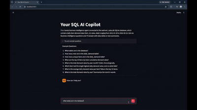
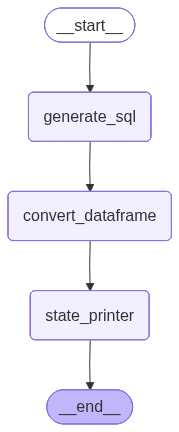
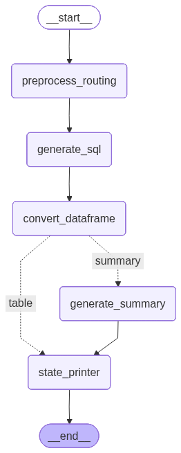

# SQL AI Copilot

A chat app that answers business questions by writing and running SQL against a local SQLite database of Walmart daily item demand. It starts as a plain text-to-SQL chain, grows into a LangGraph workflow with routing, and ends up as a Streamlit chat app. Built with LangChain, LangGraph, and OpenAI.



## Overview

**Who it's for.** Business users who need numbers but don't write SQL: category managers, demand planners, analysts on the business side, or anyone who would otherwise file a ticket with the data team and wait. Data teams are the second audience, since every question the copilot handles is a request they don't have to pick up.

**What it does for them.** You ask a question in plain English ("what were the top 10 items by demand last year?") and get back a data table or a short written summary, plus the exact SQL that produced it. No dashboard hunting, no Excel exports, no back-and-forth with an analyst.

**Business impact.**

- Cuts the time from question to answer from hours or days (ticket queue, analyst backlog) to seconds.
- Frees analysts from repetitive pull-this-number requests so they can work on things that actually need judgment.
- Showing the generated SQL keeps answers auditable: anyone can check how a number was produced instead of trusting a black box.
- The pattern is reusable. Point it at a different database and the same agent answers questions about your own sales, inventory, or operations data.

## Dataset

`data/walmart_sales.db` (SQLite), one table:

| Table | Columns | Rows | Range |
|---|---|---|---|
| `daily_demand` | `item_id` (TEXT), `value` (INTEGER), `date` (TEXT) | ~23,000 | 2011 - 2016 |

## Components

Each step has a Python script at the repo root and a matching executed notebook in `notebook/`. Each script builds on the previous one.

| # | Script | Notebook | What it does |
|---|---|---|---|
| 01 | [01_sql_agent_langgraph.py](01_sql_agent_langgraph.py) | [notebook](notebook/01_sql_agent_langgraph.ipynb) | SQL agent with `create_sql_query_chain` and a SQL-extraction utility, wrapped in a LangGraph DAG that returns a Pandas DataFrame |
| 02 | [02_add_routing_langgraph.py](02_add_routing_langgraph.py) | [notebook](notebook/02_add_routing_langgraph.ipynb) | Adds a routing preprocessor and conditional edges to return either a table or a text summary |
| 03 | [03_streamlit_bi_copilot.py](03_streamlit_bi_copilot.py) | (Streamlit app, no notebook) | "Your SQL AI Copilot", a chat UI on top of the full agent |

## Workflow Diagrams

How the graph grows across the scripts:

**01, SQL agent as a DAG**


**01, with DataFrame conversion**



**02, with routing and conditional edges (table or summary)**



## Setup

1. Activate the virtual environment (Python 3.11):

   ```powershell
   # PowerShell
   .\venv\Scripts\Activate.ps1
   ```

   ```bash
   # Git Bash
   source venv/Scripts/activate
   ```

   Or create a fresh environment and install dependencies:

   ```powershell
   pip install -r requirements.txt
   ```

2. Put your OpenAI API key in `credentials.yml` at the repo root. The file is gitignored, keep it that way:

   ```yaml
   openai: sk-...
   ```

## Running

Streamlit app:

```powershell
streamlit run 03_streamlit_bi_copilot.py
```

Open http://localhost:8501, pick a model in the sidebar, and ask something like:

- What are the top 10 items by total cumulative demand value?
- What is the total demand value by year-month? Order chronologically.
- What is the total demand value by year? Summarize the trend in words.

Notebooks: open any notebook in `notebook/` with the `sql_agent_venv` Jupyter kernel, or re-execute from the command line:

```powershell
cd notebook
..\venv\Scripts\python.exe -m jupyter nbconvert --to notebook --execute --inplace 01_sql_agent_langgraph.ipynb
```

> Notebooks use `../`-relative paths (they run from `notebook/`); the scripts use repo-root-relative paths.

## Project Structure

```
sql_agent/
├── 01_sql_agent_langgraph.py     # Agent scripts (source of truth)
├── 02_add_routing_langgraph.py
├── 03_streamlit_bi_copilot.py    # Streamlit chat app
├── credentials.yml               # OpenAI API key (gitignored, keep private)
├── requirements.txt              # Dependencies (Streamlit Cloud installs from this)
├── data/
│   └── walmart_sales.db          # SQLite: daily_demand table
├── images/                       # Demo gif + workflow diagrams
└── notebook/                     # Executed notebooks generated from the scripts
```

## Related Projects

- [Building a Multi-Agent Marketing Analytics Team That Turns Data Into Targeted Campaigns in Minutes](https://medium.com/@godfriedj98/building-a-multi-agent-marketing-analytics-team-that-turns-data-into-targeted-campaigns-in-minutes-1da49c36d9fe) 
- [Ask BI Agent Demo](https://www.youtube.com/watch?v=tSGbzTwlXnE)