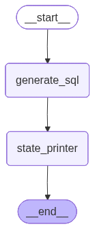

# Ask BI Agent — SQL AI Copilot on Walmart Sales

An AI-powered Business Intelligence agent — from a basic text-to-SQL chain to a routed LangGraph workflow and a chat-based Streamlit app. Built with **LangChain**, **LangGraph**, and **OpenAI**, querying a local SQLite database of Walmart daily item demand.

## Dataset

`data/walmart_sales.db` (SQLite) — a single table:

| Table | Columns | Rows | Range |
|---|---|---|---|
| `daily_demand` | `item_id` (TEXT), `value` (INTEGER), `date` (TEXT) | ~23,000 | 2011 – 2016 |

## Components

Each component exists as a Python script (repo root) and a matching executed Jupyter notebook (`notebook/`). The scripts build on each other, adding one capability at a time.

| # | Script | Notebook | What it adds |
|---|---|---|---|
| 01 | [01_sql_agent.py](01_sql_agent.py) | [notebook](notebook/01_sql_agent.ipynb) | Basic SQL agent: `create_sql_query_chain` + SQL-extraction utility |
| 02 | [02_sql_agent_langgraph.py](02_sql_agent_langgraph.py) | [notebook](notebook/02_sql_agent_langgraph.ipynb) | Introduction to LangGraph DAGs: wrap the SQL agent in a graph |
| 03 | [03_sql_agent_langgraph.py](03_sql_agent_langgraph.py) | [notebook](notebook/03_sql_agent_langgraph.ipynb) | Extends the LangGraph SQL agent with a broader set of Walmart queries |
| 04 | [04_add_pandas_langgraph.py](04_add_pandas_langgraph.py) | [notebook](notebook/04_add_pandas_langgraph.ipynb) | Executes the SQL and returns a Pandas DataFrame from graph state |
| 05 | [05_add_routing_langgraph.py](05_add_routing_langgraph.py) | [notebook](notebook/05_add_routing_langgraph.ipynb) | Routing preprocessor + conditional edges: table vs. text summary |
| 06 | [06_streamlit_bi_copilot.py](06_streamlit_bi_copilot.py) | — (Streamlit app) | "Your SQL AI Copilot" — chat UI over the full agent |

## Workflow Diagrams

The LangGraph workflow grows across the scripts:

**02–03 — SQL agent as a DAG**



**04 — add DataFrame conversion**


**05 — add routing with conditional edges (table or summary)**


## Setup

1. **Activate the virtual environment** (Python 3.11):

   ```powershell
   # PowerShell
   .\venv\Scripts\Activate.ps1
   ```

   ```bash
   # Git Bash
   source venv/Scripts/activate
   ```

   Key packages: `langchain-openai`, `langchain-classic`, `langchain-community`, `langgraph`, `pandas`, `sqlalchemy`, `streamlit`, `jupyter`.

2. **Add your OpenAI API key** in `credentials.yml` at the repo root:

   ```yaml
   openai: sk-...
   ```

## Running

**Streamlit copilot (06):**

```powershell
streamlit run 06_streamlit_bi_copilot.py
```

Then open http://localhost:8501, pick a model in the sidebar, and ask questions like:

- What are the top 10 items by total cumulative demand value?
- What is the total demand value by year-month? Order chronologically.
- What is the total demand value by year? Summarize the trend in words.

**Notebooks:** open any notebook in `notebook/` with the `ask_bi_agent_venv` Jupyter kernel, or re-execute from the command line:

```powershell
cd notebook
..\venv\Scripts\python.exe -m jupyter nbconvert --to notebook --execute --inplace 01_sql_agent.ipynb
```

> Notebooks use `../`-relative paths (they run from `notebook/`); the scripts use repo-root-relative paths.

## Project Structure

```
ask_bi_agent/
├── 01_sql_agent.py               # Agent scripts (source of truth)
├── 02_sql_agent_langgraph.py
├── 03_sql_agent_langgraph.py
├── 04_add_pandas_langgraph.py
├── 05_add_routing_langgraph.py
├── 06_streamlit_bi_copilot.py    # Streamlit chat app
├── credentials.yml               # OpenAI API key (keep private)
├── data/
│   └── walmart_sales.db          # SQLite: daily_demand table
├── images/                       # Workflow diagrams (exported from notebooks)
└── notebook/                     # Executed notebooks generated from the scripts
```
